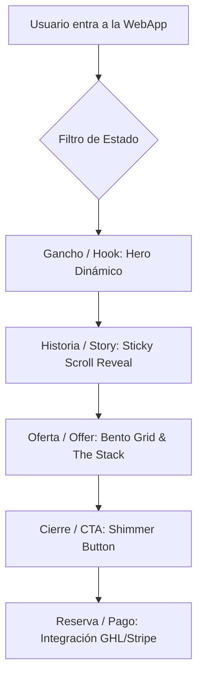

# NODRIZA WebApp - Project Plan Maestro 🚀

## 1. Arquitectura del Sistema
Utilizaremos una arquitectura modular basada en **React + Vite** para garantizar velocidad de carga y una experiencia de usuario fluida (SPA). La aplicación se comportará como un **Overlay Inteligente** para integrarse sin costuras en entornos como HighLevel (GHL).

### Estructura de Carpetas Propuesta
- `/src/components`: Componentes atómicos (Botones, Tarjetas).
- `/src/sections`: Secciones principales (Hero, Pillars, Story, Stack).
- `/src/styles`: Tokens de diseño (Colores 'Tierra Dorada', Tipografía).
- `/src/hooks`: Lógica de negocio y estados de la App.

## 2. Stack Tecnológico
- **Core**: React (Vite)
- **Estética**: Tailwind CSS + Framer Motion (@ui-ux-pro-max)
- **Componentes**: Aceternity UI / Magic UI (@21st-dev-architect)
- **Marketing**: Psicología Russell Brunson (Brain 4)

## 3. Pasos de Implementación (Checklist)

- [ ] **Fase 1: Setup & Estética Base**
    - [ ] Inicialización del proyecto con Vite.
    - [ ] Configuración de Tailwind con paleta "Tierra Dorada" (Celeste, Oro, Pasteles).
    - [ ] Implementación de `Aurora Background` y Layout Fullscreen.

- [ ] **Fase 2: Componentes Core (Hero & Pillars)**
    - [ ] Landing Hero con `Hero Video Dialog` para VSL.
    - [ ] Sección de Pilares usando `Bento Grid` con efectos de `tilt`.

- [ ] **Fase 3: Secciones de Conversión (Story & Stack)**
    - [ ] Creación de `Sticky Scroll Reveal` para la historia de la marca.
    - [ ] Diseño de "The Stack" con checklist dinámico de valor percibido.

- [ ] **Fase 4: Lógica de Negocio y Cierre**
    - [ ] Integración de CTAs con GHL (sin marcos laterales).
    - [ ] Implementación de micro-interacciones de feedback (hover/click).

- [ ] **Fase 5: Pulido & Verificación (IOS/Windows)**
    - [ ] Optimización móvil (dedos > ratón).
    - [ ] Verificación de contrastes (WCAG 2.1 AA).
    - [ ] Testeo final en Safari/iOS y Chrome/Windows.
